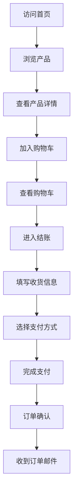
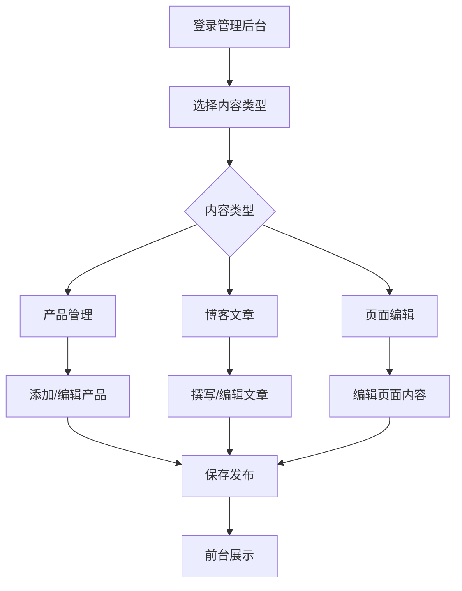

# 海外独立站产品需求文档

## 1. 产品概述

海外独立站是一个面向国际市场的电商展示和销售平台，旨在为中国制造商和贸易商提供直接面向海外客户的数字化展示窗口。该平台集成了产品展示、内容管理、电商购物、客户数据收集和数据分析等核心功能，帮助用户建立专业的海外品牌形象，实现跨境销售增长。

目标用户群体包括：
- 中国制造商寻求海外直销渠道
- 跨境电商卖家需要专业展示平台
- 贸易商希望建立品牌独立站
- 中小企业拓展国际市场

## 2. 核心功能

### 2.1 用户角色

| 角色 | 注册方式 | 核心权限 |
|------|----------|----------|
| 访客用户 | 无需注册 | 浏览产品、查看内容、添加购物车 |
| 注册用户 | 邮箱注册 | 下单购买、查看订单、管理收货地址 |
| 管理员 | 后台创建 | 管理产品、编辑内容、查看数据、处理订单 |

### 2.2 功能模块

海外独立站包含以下核心功能模块：

1. **产品展示系统**: 产品列表、产品详情、产品搜索、产品分类
2. **内容管理系统**: 页面编辑、博客管理、媒体库、SEO优化
3. **电商购物系统**: 购物车、结账流程、订单管理、支付集成
4. **表单收集系统**: 联系表单、询盘表单、订阅表单、客户信息收集
5. **数据分析系统**: 流量统计、用户行为、转化率分析、销售报告

### 2.3 页面详情

| 页面名称 | 模块名称 | 功能描述 |
|----------|----------|----------|
| 首页 | 英雄区域 | 展示品牌标语、核心产品图片、行动按钮 |
| 首页 | 产品展示 | 展示热门产品、新品推荐、分类导航 |
| 首页 | 公司介绍 | 简短介绍公司优势、服务承诺 |
| 产品列表页 | 产品筛选 | 按分类、价格、属性筛选产品 |
| 产品列表页 | 产品卡片 | 展示产品图片、名称、价格、快速查看 |
| 产品详情页 | 产品图片 | 多图展示、放大镜查看、360度展示 |
| 产品详情页 | 产品信息 | 详细参数、价格、库存、规格选择 |
| 产品详情页 | 购买操作 | 加入购物车、立即购买、询价按钮 |
| 购物车页 | 商品管理 | 修改数量、删除商品、清空购物车 |
| 购物车页 | 订单摘要 | 显示商品总价、运费、优惠信息 |
| 结账页 | 收货信息 | 填写收货地址、联系方式 |
| 结账页 | 支付方式 | 选择支付方式、填写支付信息 |
| 博客页 | 文章列表 | 展示博客文章、分类标签、搜索功能 |
| 博客详情页 | 文章内容 | 富文本展示、图片、视频嵌入 |
| 博客详情页 | 社交分享 | 分享到社交媒体、复制链接 |
| 关于我们 | 公司信息 | 公司介绍、发展历程、团队展示 |
| 联系我们 | 联系表单 | 姓名、邮箱、电话、留言内容 |
| 联系我们 | 地图展示 | 显示公司位置、交通指引 |

## 3. 核心流程

### 3.1 用户购物流程
用户从浏览到完成购买的完整流程：

### 3.2 管理员内容管理流程
管理员发布和管理内容的流程：

## 4. 用户界面设计

### 4.1 设计规范

**色彩方案：**
- 主色调：深蓝色 (#1e3a8a) - 代表专业和信任
- 辅助色：橙色 (#f97316) - 用于行动按钮和强调元素
- 中性色：灰色系 (#6b7280, #9ca3af) - 用于文本和边框
- 背景色：白色 (#ffffff) 和浅灰色 (#f9fafb)

**字体规范：**
- 标题字体：Inter Bold, 32-48px
- 正文字体：Inter Regular, 16px
- 小字体：Inter Regular, 14px
- 行高：1.5-1.6倍

**按钮样式：**
- 主要按钮：圆角8px，橙色背景，白色文字
- 次要按钮：圆角8px，白色背景，蓝色边框
- 按钮悬停：透明度变化，轻微阴影

**布局风格：**
- 采用卡片式布局，内容模块化展示
- 响应式网格系统，支持多列布局
- 顶部导航栏固定，便于快速访问

### 4.2 页面设计概览

| 页面名称 | 模块名称 | UI元素 |
|----------|----------|----------|
| 首页 | 导航栏 | Logo、主导航菜单、语言切换、购物车图标 |
| 首页 | 英雄区域 | 全宽背景图、大标题、副标题、CTA按钮 |
| 产品列表 | 筛选器 | 侧边栏筛选、价格范围滑块、属性选择 |
| 产品详情 | 图片展示 | 左侧大图轮播、右侧产品信息、放大镜效果 |
| 购物车 | 商品列表 | 商品图片、名称、价格、数量调整器 |
| 结账页 | 表单区域 | 分步骤表单、进度指示器、输入验证 |
| 博客页 | 文章卡片 | 特色图片、标题、摘要、发布时间 |

### 4.3 响应式设计

**断点设置：**
- 移动端：320px - 768px
- 平板端：768px - 1024px
- 桌面端：1024px以上

**适配策略：**
- 移动端优先设计，逐步增强
- 触摸友好的按钮和交互元素
- 图片自适应，支持Retina显示
- 字体大小根据屏幕尺寸调整

## 5. 技术要求

### 5.1 前端技术栈

**核心框架：**
- Next.js 14.2.15 - React全栈框架
- React 18 - 用户界面库
- TypeScript 5 - 类型安全开发

**样式和UI：**
- Tailwind CSS 3 - 实用优先的CSS框架
- Framer Motion - 动画库
- React Hook Form - 表单处理

**内容管理：**
- TinaCMS 1.6.38 - 可视化内容编辑
- Markdown - 内容格式化
- MDX - 富文本内容支持

**电商集成：**
- Snipcart - 购物车集成
- Stripe - 支付处理
- PayPal - 替代支付方式

### 5.2 性能指标

**核心性能指标：**
- 首次内容绘制(FCP)：≤ 1.8秒
- 最大内容绘制(LCP)：≤ 2.5秒
- 首次输入延迟(FID)：≤ 100毫秒
- 累积布局偏移(CLS)：≤ 0.1

**优化要求：**
- 图片懒加载和WebP格式
- 代码分割和懒加载
- 静态资源压缩和缓存
- CDN加速全球访问

### 5.3 SEO优化

**技术SEO：**
- 服务端渲染(SSR)支持
- 动态meta标签生成
- 结构化数据标记
- XML网站地图
- robots.txt配置

**内容SEO：**
- 关键词优化策略
- 多语言hreflang标签
- 开放图谱标签
- Twitter卡片标签

## 6. 国际化支持

### 6.1 多语言支持

**支持语言：**
- 英语(默认)
- 西班牙语
- 法语
- 德语
- 意大利语

**实现方式：**
- next-i18next集成
- 静态翻译文件
- 动态语言切换
- URL语言标识

### 6.2 本地化功能

**货币显示：**
- 自动货币转换
- 本地货币符号
- 税率计算

**日期格式：**
- 区域化日期显示
- 时区适配

**度量单位：**
- 公制/英制切换
- 自动单位转换

## 7. 第三方集成

### 7.1 表单收集系统

**Formspree集成：**
- 联系表单提交
- 询盘表单收集
- 邮件订阅管理
- 自动邮件回复

### 7.2 数据分析系统

**Google Analytics 4：**
- 页面浏览统计
- 用户行为分析
- 转化漏斗跟踪
- 电商交易跟踪

**Google Search Console：**
- 搜索性能监控
- 索引状态检查
- 搜索查询分析

### 7.3 社交媒体集成

**分享功能：**
- Facebook分享
- Twitter分享
- LinkedIn分享
- WhatsApp分享

**社交登录：**
- Google账号登录
- Facebook账号登录

## 8. 部署和运维

### 8.1 部署平台

**Vercel部署：**
- 自动CI/CD流程
- 全球CDN分发
- 自动HTTPS证书
- 自定义域名支持

### 8.2 监控和日志

**性能监控：**
- 页面加载时间监控
- 错误率统计
- 用户会话录制

**业务监控：**
- 销售数据监控
- 用户行为分析
- A/B测试结果

## 9. 安全和合规

### 9.1 数据保护

**GDPR合规：**
- 用户数据收集声明
- Cookie使用同意
- 数据删除权利
- 隐私政策展示

**数据安全：**
- HTTPS强制使用
- 输入数据验证
- XSS攻击防护
- SQL注入防护

### 9.2 支付安全

**PCI DSS合规：**
- 支付信息加密
- 安全令牌处理
- 定期安全审计

## 10. 项目里程碑

### 10.1 开发阶段

**第一阶段(2周)：**
- 基础架构搭建
- 核心页面开发
- 产品展示功能

**第二阶段(2周)：**
- TinaCMS集成
- 内容管理功能
- 多语言支持

**第三阶段(2周)：**
- Snipcart集成
- 购物流程完善
- 支付集成

**第四阶段(1周)：**
- 表单系统集成
- 数据分析集成
- 性能优化

**第五阶段(1周)：**
- 测试和调试
- 文档完善
- 部署上线

总计开发周期：8周