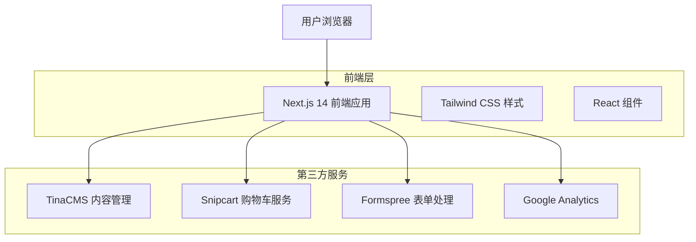
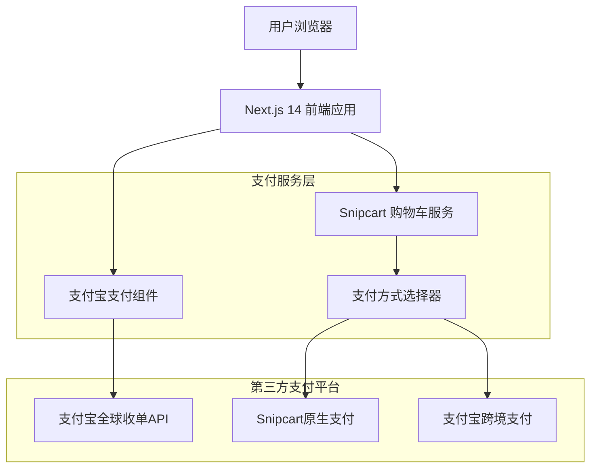
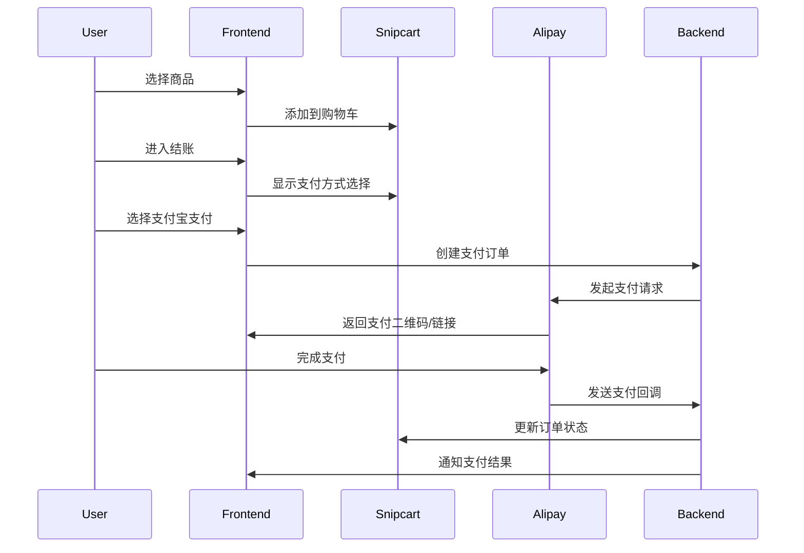

## 1. 架构设计



## 2. 技术描述

- 前端: Next.js 14.2.15 + React 18 + Tailwind CSS 3
- 内容管理: TinaCMS 1.6.38
- 电商功能: Snipcart 集成
- 表单处理: Formspree
- 分析工具: Google Analytics
- 部署平台: Vercel

## 3. 路由定义

| 路由 | 用途 |
|-------|---------|
| / | 首页，展示产品特色和导航 |
| /products | 产品列表页，显示所有产品 |
| /products/[slug] | 产品详情页，单个产品信息 |
| /cart | 购物车页面，管理购物车商品 |
| /checkout | 结账页面，完成订单支付 |
| /about | 关于我们页面，公司信息 |
| /contact | 联系我们页面，联系表单 |

## 4. 组件架构

### 4.1 核心组件结构
```
components/
├── layout/
│   ├── Header.tsx          # 网站头部导航
│   ├── Footer.tsx          # 网站底部
│   └── Layout.tsx          # 页面布局容器
├── ui/
│   ├── Button.tsx          # 按钮组件
│   ├── Card.tsx            # 卡片组件
│   └── Form.tsx            # 表单组件
├── product/
│   ├── ProductCard.tsx     # 产品卡片
│   ├── ProductList.tsx     # 产品列表
│   └── ProductDetail.tsx   # 产品详情
├── cart/
│   ├── CartIcon.tsx        # 购物车图标
│   └── CartSummary.tsx     # 购物车摘要
└── contact/
    └── ContactForm.tsx     # 联系表单
```

### 4.2 状态管理方案
- 购物车状态: Snipcart 内置状态管理
- 页面状态: React useState/useEffect
- 内容管理: TinaCMS 实时编辑状态

## 5. 性能优化策略

### 5.1 页面优化
- Next.js 静态生成 (SSG) 用于产品页面
- 图片懒加载和 WebP 格式
- 代码分割和按需加载

### 5.2 缓存策略
- 浏览器缓存静态资源
- CDN 加速图片和样式文件
- TinaCMS 内容缓存

### 5.3 SEO 优化
- Next.js 内置 SEO 支持
- 结构化数据标记
- 动态站点地图生成

## 6. 集成配置

### 6.1 TinaCMS 配置
```javascript
// tina/config.js
export default defineConfig({
  clientId: process.env.TINA_CLIENT_ID,
  branch: process.env.TINA_BRANCH,
  token: process.env.TINA_TOKEN,
  build: {
    outputFolder: "admin",
    publicFolder: "public",
  },
  media: {
    tina: {
      publicFolder: "public",
      mediaRoot: "uploads",
    },
  },
});
```

### 6.2 Snipcart 集成
```javascript
// pages/_app.tsx
import { SnipcartProvider } from '@snipcart/react';

function MyApp({ Component, pageProps }) {
  return (
    <SnipcartProvider>
      <Component {...pageProps} />
    </SnipcartProvider>
  );
}
```

### 6.3 Formspree 配置
```javascript
// components/contact/ContactForm.tsx
const formEndpoint = process.env.NEXT_PUBLIC_FORMSPREE_ENDPOINT;
```

## 7. 部署配置

### 7.1 Vercel 配置
```json
// vercel.json
{
  "buildCommand": "npm run build",
  "outputDirectory": ".next",
  "framework": "nextjs",
  "env": {
    "TINA_CLIENT_ID": "@tina-client-id",
    "SNIPCART_API_KEY": "@snipcart-api-key",
    "FORMSPREE_ENDPOINT": "@formspree-endpoint"
  }
}
```

### 7.2 环境变量
```bash
# .env.local
TINA_CLIENT_ID=your-tina-client-id
TINA_TOKEN=your-tina-token
SNIPCART_API_KEY=your-snipcart-api-key
NEXT_PUBLIC_FORMSPREE_ENDPOINT=your-formspree-endpoint
GA_TRACKING_ID=your-google-analytics-id
```

## 8. 支付系统集成

### 8.1 支付方式架构更新



### 8.2 支付宝集成方案

#### 8.2.1 支付宝全球收单（Alipay Global）
- 支持多币种结算（USD、EUR、GBP等）
- 跨境支付合规性保障
- 实时汇率转换
- 风险控制机制

#### 8.2.2 支付宝海外版配置
```javascript
// components/payment/AlipayConfig.ts
export const alipayConfig = {
  gatewayUrl: process.env.NEXT_PUBLIC_ALIPAY_GATEWAY_URL,
  appId: process.env.ALIPAY_APP_ID,
  merchantPrivateKey: process.env.ALIPAY_PRIVATE_KEY,
  alipayPublicKey: process.env.ALIPAY_PUBLIC_KEY,
  signType: 'RSA2',
  charset: 'UTF-8',
  format: 'JSON',
  version: '1.0',
  currency: 'USD',
  productCode: 'OVERSEAS_MBARCODE_PAY',
  timeout: '30m'
};
```

#### 8.2.3 支付流程设计


### 8.3 技术实现

#### 8.3.1 前端支付组件
```typescript
// components/payment/AlipayPayment.tsx
import { useState } from 'react';
import { createAlipayOrder } from '@/lib/alipay';

interface AlipayPaymentProps {
  orderData: {
    orderId: string;
    amount: number;
    currency: string;
    subject: string;
  };
  onPaymentComplete: (result: any) => void;
}

export default function AlipayPayment({ orderData, onPaymentComplete }: AlipayPaymentProps) {
  const [loading, setLoading] = useState(false);
  const [qrCode, setQrCode] = useState<string>('');

  const handleAlipayPayment = async () => {
    setLoading(true);
    try {
      const paymentResponse = await createAlipayOrder(orderData);
      setQrCode(paymentResponse.qrCode);
      // 轮询支付状态
      pollPaymentStatus(orderData.orderId);
    } catch (error) {
      console.error('支付宝支付创建失败:', error);
    } finally {
      setLoading(false);
    }
  };

  return (
    <div className="alipay-payment-container">
      <button 
        onClick={handleAlipayPayment}
        disabled={loading}
        className="alipay-pay-button"
      >
        {loading ? '处理中...' : '使用支付宝支付'}
      </button>
      {qrCode && (
        <div className="qr-code-container">
          
          <p>请使用支付宝扫描二维码完成支付</p>
        </div>
      )}
    </div>
  );
}
```

#### 8.3.2 后端支付验证
```typescript
// pages/api/alipay/notify.ts
import type { NextApiRequest, NextApiResponse } from 'next';
import { verifyAlipaySignature } from '@/lib/alipay';

export default async function handler(req: NextApiRequest, res: NextApiResponse) {
  if (req.method !== 'POST') {
    return res.status(405).json({ message: 'Method not allowed' });
  }

  try {
    // 验证支付宝签名
    const isValid = verifyAlipaySignature(req.body);
    if (!isValid) {
      return res.status(400).json({ message: 'Invalid signature' });
    }

    const { out_trade_no, trade_status, total_amount } = req.body;

    // 处理支付状态
    if (trade_status === 'TRADE_SUCCESS' || trade_status === 'TRADE_FINISHED') {
      // 更新订单状态
      await updateOrderStatus(out_trade_no, 'paid', total_amount);
      // 通知Snipcart更新订单
      await notifySnipcartOrder(out_trade_no, 'completed');
    }

    res.status(200).send('success');
  } catch (error) {
    console.error('支付宝回调处理失败:', error);
    res.status(500).send('fail');
  }
}
```

#### 8.3.3 支付状态管理
```typescript
// lib/paymentStatus.ts
export enum PaymentStatus {
  PENDING = 'pending',
  PROCESSING = 'processing',
  SUCCESS = 'success',
  FAILED = 'failed',
  CANCELLED = 'cancelled',
  REFUNDED = 'refunded'
}

export interface PaymentState {
  status: PaymentStatus;
  orderId: string;
  paymentMethod: string;
  amount: number;
  currency: string;
  updatedAt: Date;
}

export class PaymentStatusManager {
  private paymentStates: Map<string, PaymentState> = new Map();

  async updatePaymentStatus(orderId: string, status: PaymentStatus): Promise<void> {
    const currentState = this.paymentStates.get(orderId);
    if (currentState) {
      currentState.status = status;
      currentState.updatedAt = new Date();
      this.paymentStates.set(orderId, currentState);
      
      // 触发状态变更事件
      this.emitStatusChange(orderId, status);
    }
  }

  private emitStatusChange(orderId: string, status: PaymentStatus): void {
    // 发送状态变更通知
    window.dispatchEvent(new CustomEvent('paymentStatusChanged', {
      detail: { orderId, status }
    }));
  }
}
```

### 8.4 配置要求

#### 8.4.1 支付宝商户配置
```bash
# 必需的环境变量
ALIPAY_APP_ID=your-alipay-app-id
ALIPAY_PRIVATE_KEY=your-private-key
ALIPAY_PUBLIC_KEY=alipay-public-key
ALIPAY_GATEWAY_URL=https://openapi.alipay.com/gateway.do
ALIPAY_NOTIFY_URL=https://your-domain.com/api/alipay/notify
ALIPAY_RETURN_URL=https://your-domain.com/payment/success
```

#### 8.4.2 多支付方式配置
```typescript
// config/paymentMethods.ts
export const paymentMethods = [
  {
    id: 'snipcart',
    name: 'Credit Card',
    provider: 'snipcart',
    enabled: true,
    currencies: ['USD', 'EUR', 'GBP']
  },
  {
    id: 'alipay',
    name: 'Alipay',
    provider: 'alipay',
    enabled: true,
    currencies: ['USD', 'CNY'],
    config: {
      appId: process.env.ALIPAY_APP_ID,
      gatewayUrl: process.env.NEXT_PUBLIC_ALIPAY_GATEWAY_URL
    }
  }
];
```

#### 8.4.3 支付回调处理
```typescript
// middleware/paymentWebhook.ts
import { NextRequest, NextResponse } from 'next/server';

export async function handlePaymentWebhook(request: NextRequest) {
  const signature = request.headers.get('x-alipay-signature');
  const body = await request.text();
  
  // 验证请求签名
  if (!verifyWebhookSignature(body, signature)) {
    return NextResponse.json({ error: 'Invalid signature' }, { status: 401 });
  }

  try {
    const payload = JSON.parse(body);
    await processPaymentWebhook(payload);
    return NextResponse.json({ status: 'success' });
  } catch (error) {
    console.error('Webhook processing failed:', error);
    return NextResponse.json({ error: 'Processing failed' }, { status: 500 });
  }
}
```

## 9. 开发规范

### 9.1 代码结构
- 使用 TypeScript 进行类型检查
- 遵循 React 组件设计模式
- 统一的错误处理机制
- 支付相关代码模块化

### 9.2 样式规范
- Tailwind CSS 原子类优先
- 响应式设计断点标准
- 一致的间距和色彩系统
- 支付按钮样式统一

### 9.3 安全规范
- 所有支付密钥存储在环境变量中
- 敏感数据不在前端暴露
- 支付回调必须验证签名
- 使用HTTPS进行所有支付相关通信