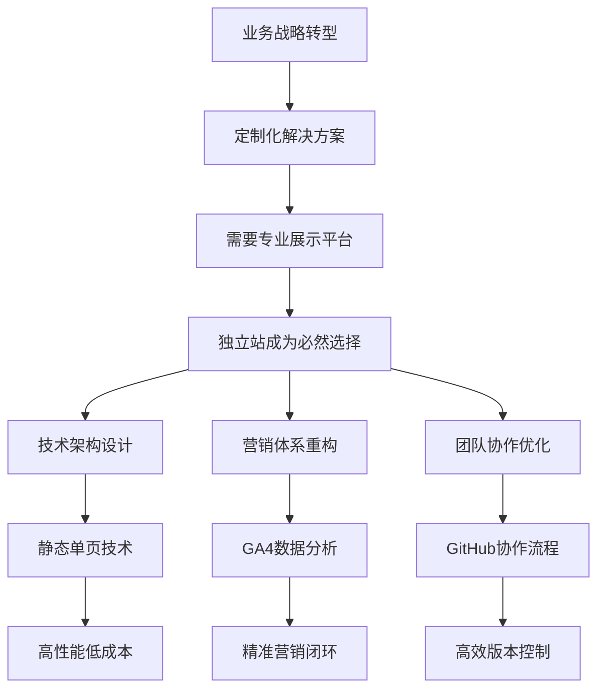
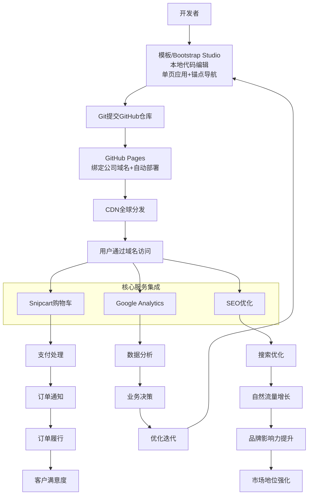
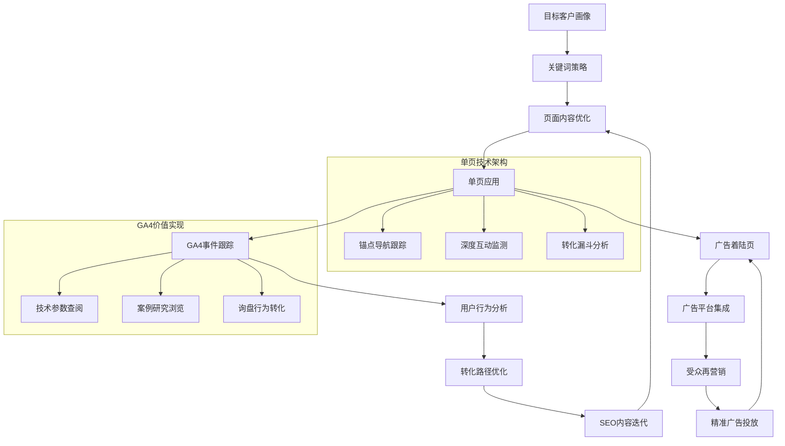
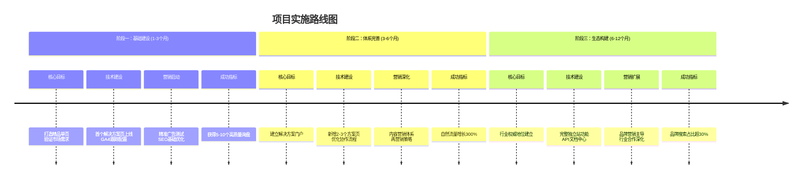

# 展馆多媒体控制系统独立站战略实施报告
## 执行摘要
本报告详细阐述了公司从平台依赖（阿里巴巴国际站）向自主数字资产（独立站）转型的战略规划。通过构建基于静态单页技术的专业解决方案展示平台，深度融合数据分析与精准营销，实现从"卖产品"到"卖方案"的业务升级。项目采用分阶段实施策略，确保技术可行性与业务价值同步实现。
---
## 一、战略背景与价值主张
### 1.1 为什么选择独立站路径？
核心洞察：对于定制化解决方案业务，独立站相比平台店铺具有不可替代的战略价值：
- **客户关系**：阿里巴巴国际站是平台中介，受制于规则；独立站可直接拥有客户关系，实现深度运营 ✅ 独立站胜出
- **品牌展示**：阿里巴巴国际站模板化，同质化严重；独立站可完全定制，塑造专业形象 ✅ 独立站胜出
- **利润空间**：阿里巴巴国际站价格透明，竞争激烈；独立站可采用价值定价，提升溢价能力 ✅ 独立站胜出
- **数据资产**：阿里巴巴国际站数据受限，部分脱敏；独立站可获取完整数据，进行深度挖掘 ✅ 独立站胜出
- **长期价值**：阿里巴巴国际站为平台积累资产；独立站为自身积累资产 ✅ 独立站胜出
### 1.2 解决方案定位验证
当前业务重心已从"大批量标准品"转向"小批量定制化解决方案"，独立站能够：
- 深度展示技术实力与行业理解
- 建立专业可信的品牌形象
- 吸引高质量定制化客户
- 支撑更高的客单价和利润空间

---
## 二、技术架构设计
### 2.1 核心架构原理
采用现代化前端技术栈，构建高性能、易维护的解决方案展示平台：
技术选型原则：
- ✅ 去依赖：避免平台锁定，完全自主可控
- ✅ 高性能：静态页面，全球CDN加速
- ✅ 易维护：版本控制，自动化部署
- ✅ 可扩展：模块化设计，平滑演进
系统架构图：

### 2.2 部署与发布流程
GitHub Pages自动化部署：
1. 开发阶段：使用Bootstrap Studio或纯代码开发单页应用
2. 版本控制：通过Git提交到GitHub仓库，保留完整修改记录
3. 自动部署：GitHub Pages自动检测变更并部署到全球CDN
4. 域名绑定：使用公司主域名，提升专业形象
关键优势：
- 零服务器维护成本
- 自动SSL证书配置
- 全球CDN加速访问
- 回滚简单（通过Git版本控制）
---
## 三、营销与数据分析体系
### 3.1 精准营销闭环设计
构建数据驱动的营销体系，确保每一分广告投入都产生可衡量的回报：

### 3.2 GA4事件跟踪策略
关键转化事件设计：
- section_view：各解决方案区块浏览深度
- tech_doc_download：技术文档下载行为
- case_study_view：成功案例查看次数
- contact_click：联系动作触发时机
- quote_request：定制询盘提交完成
数据驱动优化：
- 基于用户行为路径优化页面布局
- 根据转化漏斗分析调整内容策略
- 利用再营销受众提高广告ROI
### 3.3 SEO与内容策略
关键词矩阵规划：
搜索意图与内容板块映射：
- **品牌搜索**：核心关键词「展馆多媒体控制系统」→ 对应「产品概述锚点」
- **解决方案**：核心关键词「博物馆中控系统定制」→ 对应「解决方案详情」
- **技术需求**：核心关键词「多媒体控制设备API」→ 对应「技术文档下载」
内容优化重点：
- 结构化数据标记（Schema.org）
- 移动端用户体验优化
- 页面加载速度极致化
---
## 四、团队协作与版本管理
### 4.1 分阶段协作方案
阶段一：方案B（快速启动，简单协作）
- 时间：项目启动后1-3个月
- 模式：单GitHub仓库，多目录协作
- 权限：路径级别权限控制
- 优势：设置简单，协作直观，快速验证
阶段二：方案A（专业治理，权限分离）
- 时间：业务稳定后3-6个月
- 模式：Git子模块，多仓库协作
- 权限：仓库级别严格分离
- 优势：权限清晰，独立开发，专业规范
### 4.2 协作流程设计
初期工作流（方案B）：
```
博客团队 → 编辑/blog目录 → Pull Request审核 → 合并到main分支
产品团队 → 编辑/products目录 → Pull Request审核 → 合并到main分支
主维护者 → 审核所有PR + 处理全局配置
```
演进工作流（方案A）：
```
博客团队 → 独立blog-repo开发 → 主仓库引用为子模块
产品团队 → 独立products-repo开发 → 主仓库引用为子模块
主维护者 → 子模块版本管理 + 全局集成
```
### 4.3 权限管理策略
角色定义：
- 管理员：完整权限，负责技术架构和集成
- 内容团队：博客/产品目录写入权限
- 开发团队：特定功能模块开发权限
安全控制：
- PR机制确保代码质量
- 分支保护规则防止直接推送main分支
- 定期备份确保数据安全
---
## 五、实施路线图与里程碑
### 5.1 三阶段实施计划

### 5.2 关键里程碑定义
|时间点|技术里程碑|业务里程碑|成功指标|
|Month 1|首个解决方案页上线|获得初始询盘|3-5个高质量线索|
|Month 3|GA4数据分析体系完善|转化路径优化|询盘成本降低30%|
|Month 6|多解决方案门户建成|行业影响力建立|自然流量超1000UV/月|
|Month 12|完整独立站生态|品牌搜索主导|品牌词搜索占比30%|

            时间点
            技术里程碑
            业务里程碑
            成功指标
            Month 1
            首个解决方案页上线
            获得初始询盘
            3-5个高质量线索
            Month 3
            GA4数据分析体系完善
            转化路径优化
            询盘成本降低30%
            Month 6
            多解决方案门户建成
            行业影响力建立
            自然流量超1000UV/月
            Month 12
            完整独立站生态
            品牌搜索主导
            品牌词搜索占比30%
---
## 六、风险控制与应对策略
### 6.1 技术风险控制
部署风险：
- 风险点：自动化部署失败
- 应对：保留手动部署备选方案，部署前充分测试
兼容性风险：
- 风险点：浏览器兼容性问题
- 应对：多浏览器测试，渐进增强设计原则
### 6.2 业务风险控制
流量风险：
- 风险点：初期自然流量不足
- 应对：广告投放保障基础流量，内容营销长期建设
转化风险：
- 风险点：页面转化率不达预期
- 应对：A/B测试优化，基于GA4数据持续迭代
### 6.3 协作风险控制
权限风险：
- 风险点：多人协作冲突
- 应对：清晰的权限规范，代码审查机制
知识风险：
- 风险点：技术栈学习曲线
- 应对：文档完善，渐进式培训计划
---
## 七、预期投入与回报分析
### 7.1 投入估算
初期投入（1-3个月）：
- 技术开发：40人/天（主开发人员）
- 内容创作：20人/天（解决方案内容）
- 广告测试预算：￥10,000-20,000
持续投入（月度）：
- 内容更新：5人/天
- 数据分析：3人/天
- 广告优化：￥5,000-10,000
### 7.2 预期回报
直接回报：
- 优质询盘数量提升：+50%
- 客单价提升：+30%（品牌溢价）
- 客户获取成本降低：-25%（精准营销）
战略回报：
- 数字资产积累：品牌价值持续增值
- 市场地位提升：行业解决方案领导者形象
- 团队能力建设：数字化营销与运营能力
---
## 八、结论与下一步行动
### 8.1 战略价值重申
该产品独立站是一个基于静态单页技术、通过GitHub Pages自动部署的解决方案，深度融合GA4事件跟踪、Snipcart电商功能及SEO优化，旨在通过数据驱动的广告投放精准触达并转化展馆多媒体控制系统的目标客户。
此项目不仅是技术平台建设，更是公司数字化转型的核心载体，将支撑业务从"产品供应商"向"解决方案合作伙伴"的战略升级。
### 8.2 立即行动建议
第一周行动项：
- [ ] 注册/确认公司主域名
- [ ] 创建GitHub组织账号
- [ ] 组建项目核心团队（技术+内容）
第一月交付物：
- [ ] 首个解决方案单页上线（展馆多媒体控制系统）
- [ ] GA4基础跟踪配置完成
- [ ] 初始广告测试计划启动
决策需求：
- 确认项目启动时间与资源分配
- 确定核心团队成员与职责分工
- 审批初期投入预算
---
## 附录
### 附录A：技术栈详细说明
### 附录B：团队协作规范（草案）
### 附录C：竞争对手独立站分析
报告完 - 敬请审议决策
本报告由战略技术委员会编制，旨在为公司的数字化转型升级提供完整可行的实施方案。期待与各位同事共同讨论完善。

（注：文档部分内容可能由 AI 生成）